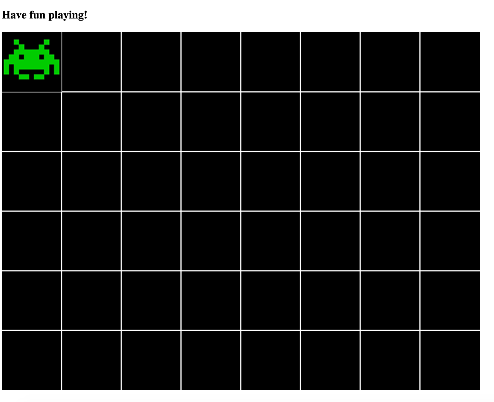

# Space Invaders - Unit 1

This lesson will introduce you to one of the most fundamental concepts of programming, the algorithm, and a the notion of type.  Detailed talking points can be found [here](DETAILS.md).

## You Do

1. Introduce the fundamdental concepts, algorithms and types.
2. Bring up the starter [jsbin](http://jsbin.com/rafoka) and demonstrate some space invader game functionality.
3. Show the students the API, linked below.

## We Do

1. Draw the number zero in white.
2. Discuss and demonstrate the thought process of the thinking up the steps.

## They Do

1. Have the students write the letters S, followed by a space, then E (ScriptEd initials).
2. If they finish this before class is over think of other interesting shapes to draw.

## API
View the API docs [here](API.md).
